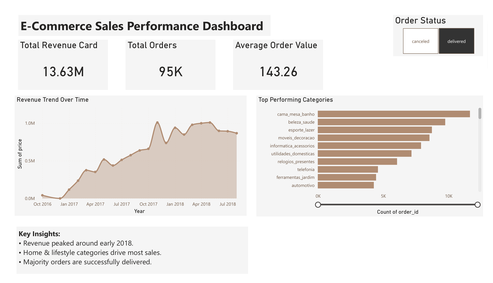

<div align="center">

# 🛒 E-Commerce Customer Behavior Analysis

### Transforming Raw Transactional Data into Actionable Business Insights


</div>

---

## 📌 Project Overview

This project analyzes a real-world **Brazilian E-Commerce dataset (Olist)** to uncover customer purchasing patterns, sales performance, and business trends using **SQL** and **Power BI**.

> 💡 *"Data analysis isn't just about making charts — it's about finding the 'why' behind numbers and turning them into business decisions."*

---

## 🎯 Business Problem

E-commerce companies generate massive amounts of transactional data but often struggle to extract actionable insights. This project answers critical business questions:

| ❓ Business Question | ✅ Answered With |
|---|---|
| How are sales trending over time? | Revenue Trend Line Chart |
| Which categories generate the most orders? | Top Categories Bar Chart |
| What is the average customer spend? | AOV KPI Card |
| How many orders are successfully delivered? | Order Status Filter |
| When did revenue peak & why did it drop? | Monthly Sales Analysis |

---

## 📊 Dashboard Preview

> 

---

## 💡 Key Business Insights

```
📈  Revenue grew 10x from Oct 2016 → Apr 2018
🏠  Home & Lifestyle categories drive maximum sales volume  
✅  Majority of 95K+ orders were successfully delivered
📉  Post-April 2018 drop → signals potential customer churn
💰  Average Order Value: 143.26 | Total Revenue: 13.63M
```

> 🔍 **Recommendation:** The sharp revenue decline post-April 2018 suggests customer churn. Launching a **loyalty & retention program** targeting top-spending customers could recover 20–30% of lost revenue.

---

## 🧰 Tools & Technologies

| Tool | Purpose |
|------|---------|
| 🐘 **PostgreSQL** | Data storage, cleaning & SQL analysis |
| 🖥️ **DBeaver / pgAdmin** | Database management |
| 📊 **Power BI** | Interactive dashboard & visualization |
| 🐙 **GitHub** | Version control & project showcase |

---

## 📂 Dataset

> ⚠️ Dataset is large and not uploaded directly to GitHub.

- **Source:** [Brazilian E-Commerce Public Dataset by Olist — Kaggle](https://www.kaggle.com/datasets/olistbr/brazilian-ecommerce)
- **Download:** 👉 [Google Drive Link](https://drive.google.com/drive/folders/1SivKaouXgTxyVTpENuGKupP2gzj0wz5Z?usp=drive_link)

**Dataset contains:**
`order_id` • `customer_id` • `product_category` • `price` • `payment_type` • `order_status` • `purchase_timestamp` • `delivery_date` • and more...

---

## 🔍 Data Cleaning (SQL)

```sql
-- Example: Filtering only delivered orders
SELECT * FROM ecommerce_orders
WHERE order_status = 'delivered'
  AND order_delivered_customer_date IS NOT NULL;

-- Checking for NULLs
SELECT COUNT(*) FROM ecommerce_orders
WHERE customer_id IS NULL OR price IS NULL;
```

**Cleaning Steps Performed:**
- ✅ Checked and handled NULL values
- ✅ Verified & removed duplicate orders
- ✅ Validated order status values
- ✅ Converted text dates → TIMESTAMP format
- ✅ Filtered only `delivered` orders for revenue analysis

---

## 📈 Key Analysis Performed

```sql
-- Total Revenue
SELECT ROUND(SUM(price)::NUMERIC, 2) AS total_revenue
FROM ecommerce_orders WHERE order_status = 'delivered';

-- Monthly Sales Trend
SELECT DATE_TRUNC('month', order_purchase_timestamp) AS month,
       ROUND(SUM(price)::NUMERIC, 2) AS monthly_revenue
FROM ecommerce_orders
GROUP BY month ORDER BY month;

-- Top Selling Categories
SELECT product_category_name,
       COUNT(order_id) AS total_orders
FROM ecommerce_orders
GROUP BY product_category_name
ORDER BY total_orders DESC LIMIT 10;
```

---

## 📁 Project Files

```
📦 ecommerce-analysis/
├── 📄 README.md
├── 🗄️ E-Commerce Customer Behavior Analysis.sql   ← All SQL queries
├── 📊 dashboard.pbix                               ← Power BI file
└── 📑 dashboard_export.pdf                         ← Dashboard PDF export
```

---

## 🚀 Dashboard Features (Power BI)

- ✅ **Total Revenue KPI** — 13.63M
- ✅ **Total Orders KPI** — 95K+
- ✅ **Average Order Value** — 143.26
- ✅ **Revenue Trend Over Time** — Line Chart
- ✅ **Top Performing Categories** — Bar Chart
- ✅ **Order Status Filter** — Delivered / Cancelled slicer

---

## 👤 Author

<div align="center">

**Nitish**
*Aspiring Data Analyst | SQL • Power BI • Data Visualization*

[](https://www.linkedin.com/in/nitish-redhu/)

</div>

---

<div align="center">
⭐ <i>If you found this project useful, please give it a star!</i> ⭐
</div>
